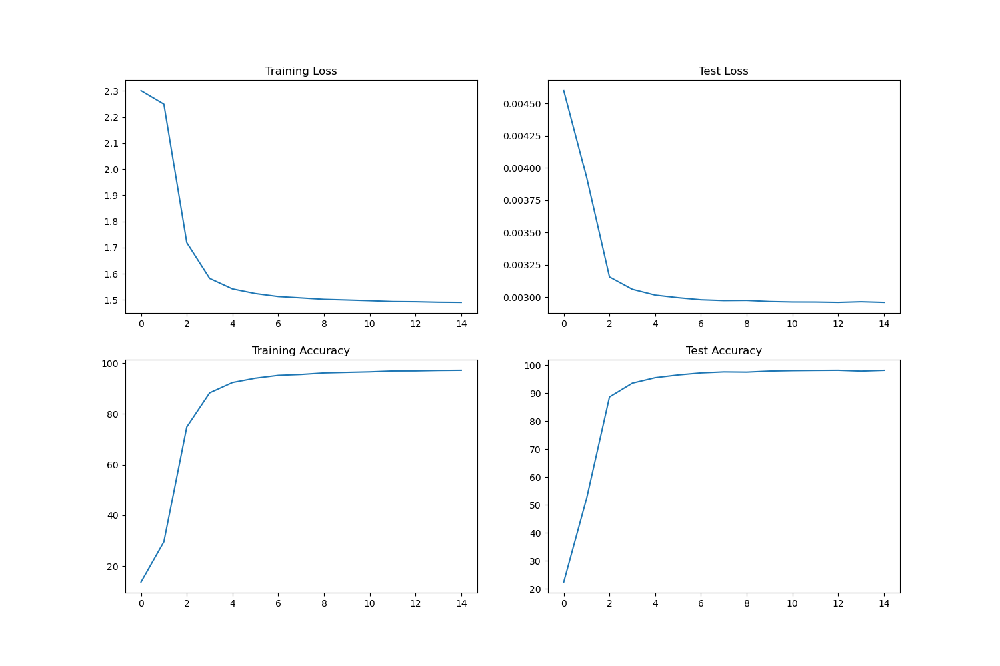

# ERA_V1_SESSION_5
This repo contains the code to train the MNIST from scratch.

## Install requirements
 pip install -r requirements.txt

## Network Architecture

| Layer (type) | Output Shape | Param # |
|--------------|--------------|---------|
| Conv2d-1     | [-1, 32, 26, 26] | 320     |
| Conv2d-2     | [-1, 64, 24, 24] | 18,496  |
| Conv2d-3     | [-1, 128, 10, 10] | 73,856  |
| Conv2d-4     | [-1, 256, 8, 8]  | 295,168 |
| Linear-5     | [-1, 50]         | 204,850 |
| Linear-6     | [-1, 10]         | 510     |

**Total params:** 593,200  
**Trainable params:** 593,200  
**Non-trainable params:** 0  

**Input size (MB):** 0.00  
**Forward/backward pass size (MB):** 0.67  
**Params size (MB):** 2.26  
**Estimated Total Size (MB):** 2.94  


## Train Network
We have trained the network for 15 epochs and achieved the following results:
- **Best train accuracy**: 96.96
- **Best test accuracy**: 98.17

```
Epoch 1
Train: Loss= 2.2972 Batch_id=117 Accuracy=13.70: 100%|██████████| 118/118 [00:09<00:00, 11.90it/s]
Test set: Average loss: 0.0046, Accuracy: 2246/10000 (22.46%)

Epoch 2
Train: Loss= 1.9998 Batch_id=117 Accuracy=29.58: 100%|██████████| 118/118 [00:10<00:00, 11.65it/s]
Test set: Average loss: 0.0039, Accuracy: 5238/10000 (52.38%)

Epoch 3
Train: Loss= 1.5986 Batch_id=117 Accuracy=74.86: 100%|██████████| 118/118 [00:10<00:00, 11.77it/s]
Test set: Average loss: 0.0032, Accuracy: 8864/10000 (88.64%)

Epoch 4
Train: Loss= 1.5582 Batch_id=117 Accuracy=88.32: 100%|██████████| 118/118 [00:10<00:00, 11.63it/s]
Test set: Average loss: 0.0031, Accuracy: 9358/10000 (93.58%)

Epoch 5
Train: Loss= 1.5397 Batch_id=117 Accuracy=92.39: 100%|██████████| 118/118 [00:10<00:00, 11.55it/s]
Test set: Average loss: 0.0030, Accuracy: 9552/10000 (95.52%)

Epoch 6
Train: Loss= 1.5234 Batch_id=117 Accuracy=94.09: 100%|██████████| 118/118 [00:10<00:00, 11.44it/s]
Test set: Average loss: 0.0030, Accuracy: 9650/10000 (96.50%)

Epoch 7
Train: Loss= 1.5186 Batch_id=117 Accuracy=95.20: 100%|██████████| 118/118 [00:10<00:00, 10.99it/s]
Test set: Average loss: 0.0030, Accuracy: 9723/10000 (97.23%)

Epoch 8
Train: Loss= 1.4863 Batch_id=117 Accuracy=95.56: 100%|██████████| 118/118 [00:10<00:00, 11.00it/s]
Test set: Average loss: 0.0030, Accuracy: 9759/10000 (97.59%)

Epoch 9
Train: Loss= 1.5181 Batch_id=117 Accuracy=96.16: 100%|██████████| 118/118 [00:10<00:00, 11.61it/s]
Test set: Average loss: 0.0030, Accuracy: 9751/10000 (97.51%)

Epoch 10
Train: Loss= 1.5389 Batch_id=117 Accuracy=96.38: 100%|██████████| 118/118 [00:10<00:00, 11.55it/s]
Test set: Average loss: 0.0030, Accuracy: 9789/10000 (97.89%)

Epoch 11
Train: Loss= 1.4992 Batch_id=117 Accuracy=96.58: 100%|██████████| 118/118 [00:10<00:00, 11.57it/s]
Test set: Average loss: 0.0030, Accuracy: 9804/10000 (98.04%)

Epoch 12
Train: Loss= 1.5041 Batch_id=117 Accuracy=96.93: 100%|██████████| 118/118 [00:10<00:00, 11.01it/s]
Test set: Average loss: 0.0030, Accuracy: 9812/10000 (98.12%)

Epoch 13
Train: Loss= 1.4913 Batch_id=117 Accuracy=96.96: 100%|██████████| 118/118 [00:10<00:00, 11.47it/s]
Test set: Average loss: 0.0030, Accuracy: 9817/10000 (98.17%)

Epoch 14
Train: Loss= 1.4860 Batch_id=117 Accuracy=97.13: 100%|██████████| 118/118 [00:10<00:00, 11.41it/s]
Test set: Average loss: 0.0030, Accuracy: 9787/10000 (97.87%)

Epoch 15
Train: Loss= 1.5069 Batch_id=117 Accuracy=97.20: 100%|██████████| 118/118 [00:10<00:00, 11.44it/s]
Test set: Average loss: 0.0030, Accuracy: 9815/10000 (98.15%)
```
## Observation
1. By Epoch 10, the test accuracy is already quite high at 97.89%, and it only improves slightly in the subsequent epochs. This suggests that the model is converging and additional epochs may not yield significant improvements.
2. Notice that the test accuracy plateaus around 98%.

Following is graph for training outcomes

