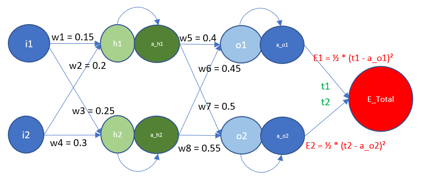

# ERA_V1_SESSION_6
This repo contains code which describes back propagation and also contain the improved model for MNIST datasets

Here is the link for BackPropagation excel file. 
[Sheet](BackPropagation.xlsx)

## Network Architecture
  

## Forward propagation steps:

* First initialized the weights with random values.
* Perform Dot products on each stage between weights and the inputs.
* Afterward the activation functions are applied at each stage
* Error is calculated between the target and the output of the last layer using MSE
### Forward Pass Equations
$$
\begin{align*}
h1 &= w1 \cdot i1 + w2 \cdot i2 \\
h2 &= w3 \cdot i1 + w4 \cdot i2 \\
a_{h1} &= \sigma(h1) = \frac{1}{1 + \exp(-h1)} \\
a_{h2} &= \sigma(h2) \\
o1 &= w5 \cdot a_{h1} + w6 \cdot a_{h2} \\
o2 &= w7 \cdot a_{h1} + w8 \cdot a_{h2} \\
a_{o1} &= \sigma(o1) \\
a_{o2} &= \sigma(o2) \\
E_{total} &= E1 + E2 \\
E1 &= \frac{1}{2} \cdot (t1 - a_{o1})^2 \\
E2 &= \frac{1}{2} \cdot (t2 - a_{o2})^2 \\
\end{align*}
$$

## Steps in Backward Propagation:

* Calculate the Partial differentiation from error (output) to the input layer using the chain rule
    
* After the calculation, the values of the weights gets updated by  

## Backpropagation Equations

### Gradient with respect to \( w5 \)
$$
\begin{align*}
\frac{\partial E_{total}}{\partial w5} &= \frac{\partial (E1 + E2)}{\partial w5} \\
\frac{\partial E_{total}}{\partial w5} &= \frac{\partial E1}{\partial w5} \\
\frac{\partial E_{total}}{\partial w5} &= \frac{\partial E1}{\partial w5} = \frac{\partial E1}{\partial a_{o1}} \cdot \frac{\partial a_{o1}}{\partial o1} \cdot \frac{\partial o1}{\partial w5} \\
\frac{\partial E1}{\partial a_{o1}} &= \frac{\partial \left( \frac{1}{2} (t1 - a_{o1})^2 \right)}{\partial a_{o1}} = (a_{o1} - t1) \\
\frac{\partial a_{o1}}{\partial o1} &= \frac{\partial \sigma(o1)}{\partial o1} = a_{o1} \cdot (1 - a_{o1}) \\
\frac{\partial o1}{\partial w5} &= a_{h1} \\
\frac{\partial E_{total}}{\partial w5} &= (a_{o1} - t1) \cdot a_{o1} \cdot (1 - a_{o1}) \cdot a_{h1} \\
\end{align*}
$$

### Gradient with respect to \( w6 \)
$$
\begin{align*}
\frac{\partial E_{total}}{\partial w6} &= (a_{o1} - t1) \cdot a_{o1} \cdot (1 - a_{o1}) \cdot a_{h2} \\
\end{align*}
$$

### Gradient with respect to \( w7 \)
$$
\begin{align*}
\frac{\partial E_{total}}{\partial w7} &= (a_{o2} - t2) \cdot a_{o2} \cdot (1 - a_{o2}) \cdot a_{h1} \\
\end{align*}
$$

### Gradient with respect to \( w8 \)
$$
\begin{align*}
\frac{\partial E_{total}}{\partial w8} &= (a_{o2} - t2) \cdot a_{o2} \cdot (1 - a_{o2}) \cdot a_{h2} \\
\end{align*}
$$

### Hidden Layer Gradients
$$
\begin{align*}
\frac{\partial E1}{\partial a_{h1}} &= (a_{o1} - t1) \cdot a_{o1} \cdot (1 - a_{o1}) \cdot w5 \\
\frac{\partial E2}{\partial a_{h1}} &= (a_{o2} - t2) \cdot a_{o2} \cdot (1 - a_{o2}) \cdot w7 \\
\frac{\partial E_{total}}{\partial a_{h1}} &= (a_{o1} - t1) \cdot a_{o1} \cdot (1 - a_{o1}) \cdot w5 + (a_{o2} - t2) \cdot a_{o2} \cdot (1 - a_{o2}) \cdot w7 \\
\frac{\partial E_{total}}{\partial a_{h2}} &= (a_{o1} - t1) \cdot a_{o1} \cdot (1 - a_{o1}) \cdot w6 + (a_{o2} - t2) \cdot a_{o2} \cdot (1 - a_{o2}) \cdot w8 \\
\end{align*}
$$

### Weight Gradients
$$
\begin{align*}
\frac{\partial E_{total}}{\partial w1} &= \frac{\partial E_{total}}{\partial a_{h1}} \cdot \frac{\partial a_{h1}}{\partial h1} \cdot \frac{\partial h1}{\partial w1} \\
\frac{\partial E_{total}}{\partial w2} &= \frac{\partial E_{total}}{\partial a_{h1}} \cdot \frac{\partial a_{h1}}{\partial h1} \cdot \frac{\partial h1}{\partial w2} \\
\frac{\partial E_{total}}{\partial w3} &= \frac{\partial E_{total}}{\partial a_{h2}} \cdot \frac{\partial a_{h2}}{\partial h2} \cdot \frac{\partial h2}{\partial w3} \\
\end{align*}
$$

### Final Gradients
$$
\begin{align*}
\frac{\partial E_{total}}{\partial w1} &= \left( (a_{o1} - t1) \cdot a_{o1} \cdot (1 - a_{o1}) \cdot w5 + (a_{o2} - t2) \cdot a_{o2} \cdot (1 - a_{o2}) \cdot w7 \right) \cdot a_{h1} \cdot (1 - a_{h1}) \cdot i1 \\
\frac{\partial E_{total}}{\partial w2} &= \left( (a_{o1} - t1) \cdot a_{o1} \cdot (1 - a_{o1}) \cdot w5 + (a_{o2} - t2) \cdot a_{o2} \cdot (1 - a_{o2}) \cdot w7 \right) \cdot a_{h1} \cdot (1 - a_{h1}) \cdot i2 \\
\frac{\partial E_{total}}{\partial w3} &= \left( (a_{o1} - t1) \cdot a_{o1} \cdot (1 - a_{o1}) \cdot w6 + (a_{o2} - t2) \cdot a_{o2} \cdot (1 - a_{o2}) \cdot w8 \right) \cdot a_{h2} \cdot (1 - a_{h2}) \cdot i1 \\
\frac{\partial E_{total}}{\partial w4} &= \left( (a_{o1} - t1) \cdot a_{o1} \cdot (1 - a_{o1}) \cdot w6 + (a_{o2} - t2) \cdot a_{o2} \cdot (1 - a_{o2}) \cdot w8 \right) \cdot a_{h2} \cdot (1 - a_{h2}) \cdot i2 \\
\end{align*}
$$

## Results & Inference:
* When the learning rate is 2, the error seems to be low. The higher the learning rate, the network converged faster, and less error is observed in this case.
